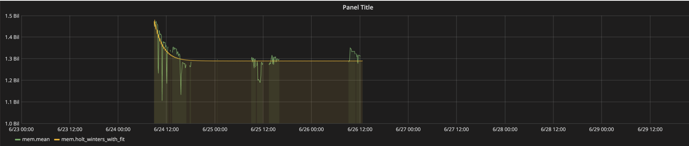

---
author:
- Rohan Kumar
- Shriya Nandwani
title: 'Holt-Winters'
---

<!--markdownlint-disable single-h1-->

Exponential Smoothing
=====================

Single exponential smoothing
----------------------------

$$s_{t}=\alpha \cdot x_{t}+(1-\alpha )\cdot s_{t-1}=s_{t-1}+\alpha \cdot (x_{t}-s_{t-1})$$

where $a$ is the *time constant*

::: {.notes}
Speaker notes
:::

Double/Triple exponential smoothing
-----------------------------------

Holt-Winters
------------

<math xmlns="http://www.w3.org/1998/Math/MathML" display="block"><semantics><mrow><mtable columnalign="right left right left right left right left right left right left" rowspacing="3pt" columnspacing="0em 2em 0em 2em 0em 2em 0em 2em 0em 2em 0em" displaystyle="true"><mtr><mtd><msub><mrow class="MJX-TeXAtom-ORD"><mover><mi>y</mi><mo stretchy="false">\^</mo></mover></mrow><mrow class="MJX-TeXAtom-ORD"><mi>t</mi><mo>+</mo><mi>h</mi><mrow class="MJX-TeXAtom-ORD"><mo stretchy="false">\|</mo></mrow><mi>t</mi></mrow></msub></mtd><mtd><mi/><mo>=</mo><mo stretchy="false">(</mo><msub><mi>ℓ</mi><mrow class="MJX-TeXAtom-ORD"><mi>t</mi></mrow></msub><mo>+</mo><mi>h</mi><msub><mi>b</mi><mrow class="MJX-TeXAtom-ORD"><mi>t</mi></mrow></msub><mo stretchy="false">)</mo><msub><mi>s</mi><mrow class="MJX-TeXAtom-ORD"><mi>t</mi><mo>+</mo><mi>h</mi><mo>−</mo><mi>m</mi><mo stretchy="false">(</mo><mi>k</mi><mo>+</mo><mn>1</mn><mo stretchy="false">)</mo></mrow></msub></mtd></mtr>
<mtr><mtd><msub><mi>ℓ</mi><mrow class="MJX-TeXAtom-ORD"><mi>t</mi></mrow></msub></mtd><mtd><mi/><mo>=</mo><mi>α</mi><mfrac><msub><mi>y</mi><mrow class="MJX-TeXAtom-ORD"><mi>t</mi></mrow></msub><msub><mi>s</mi><mrow class="MJX-TeXAtom-ORD"><mi>t</mi><mo>−</mo><mi>m</mi></mrow></msub></mfrac><mo>+</mo><mo stretchy="false">(</mo><mn>1</mn><mo>−</mo><mi>α</mi><mo stretchy="false">)</mo><mo stretchy="false">(</mo><msub><mi>ℓ</mi><mrow class="MJX-TeXAtom-ORD"><mi>t</mi><mo>−</mo><mn>1</mn></mrow></msub><mo>+</mo><msub><mi>b</mi><mrow class="MJX-TeXAtom-ORD"><mi>t</mi><mo>−</mo><mn>1</mn></mrow></msub><mo stretchy="false">)</mo></mtd></mtr><mtr><mtd><msub><mi>b</mi><mrow class="MJX-TeXAtom-ORD"><mi>t</mi></mrow></msub></mtd><mtd><mi/><mo>=</mo><msup><mi>β</mi><mo>∗</mo></msup><mo stretchy="false">(</mo><msub><mi>ℓ</mi><mrow class="MJX-TeXAtom-ORD"><mi>t</mi></mrow></msub><mo>−</mo><msub><mi>ℓ</mi><mrow class="MJX-TeXAtom-ORD"><mi>t</mi><mo>−</mo><mn>1</mn></mrow></msub><mo stretchy="false">)</mo><mo>+</mo><mo stretchy="false">(</mo><mn>1</mn><mo>−</mo><msup><mi>β</mi><mo>∗</mo></msup><mo stretchy="false">)</mo><msub><mi>b</mi><mrow class="MJX-TeXAtom-ORD"><mi>t</mi><mo>−</mo><mn>1</mn></mrow></msub></mtd></mtr><mtr><mtd><msub><mi>s</mi><mrow class="MJX-TeXAtom-ORD"><mi>t</mi></mrow></msub></mtd><mtd><mi/><mo>=</mo><mi>γ</mi><mfrac><msub><mi>y</mi><mrow class="MJX-TeXAtom-ORD"><mi>t</mi></mrow></msub><mrow><mo stretchy="false">(</mo><msub><mi>ℓ</mi><mrow class="MJX-TeXAtom-ORD"><mi>t</mi><mo>−</mo><mn>1</mn></mrow></msub><mo>+</mo><msub><mi>b</mi><mrow class="MJX-TeXAtom-ORD"><mi>t</mi><mo>−</mo><mn>1</mn></mrow></msub><mo stretchy="false">)</mo></mrow></mfrac><mo>+</mo><mo stretchy="false">(</mo><mn>1</mn><mo>−</mo><mi>γ</mi><mo stretchy="false">)</mo><msub><mi>s</mi><mrow class="MJX-TeXAtom-ORD"><mi>t</mi><mo>−</mo><mi>m</mi></mrow></msub></mtd></mtr></mtable></mrow><annotation encoding="application/x-tex">\begin{align*}
  \hat{y}_{t+h|t} &amp;= (\ell_{t} + hb_{t})s_{t+h-m(k+1)} \\
  \ell_{t} &amp;= \alpha \frac{y_{t}}{s_{t-m}} + (1 - \alpha)(\ell_{t-1} + b_{t-1})\\
  b_{t} &amp;= \beta^*(\ell_{t}-\ell_{t-1}) + (1 - \beta^*)b_{t-1}                \\
  s_{t} &amp;= \gamma \frac{y_{t}}{(\ell_{t-1} + b_{t-1})} + (1 - \gamma)s_{t-m}
\end{align*}</annotation></semantics></math>

::: {.notes}
Notice tht $\beta$ and $\gamma$ are time constants.
:::

Use in InfluxDB
===============

Syntax & Implementation
------------

`HOLT_WINTERS[_WITH-FIT](<function>(<field_key>),<N>,<S>)`

- !N is how many points you want to predict
- !S is seasonality
	- calculated from  alpha, beta, and gamma vals
	- in order to find these three values we use the Nelder-Mead optimization
		- draws increasingly smaller areas w/ different vals for the params until converge

Water Levels
------------

Memory usage
------------

`holt_winters_with_fit(mean("available"), 10, 4) FROM "mem" WHERE $timeFilter GROUP BY time($__interval) fill(null)`

Questions
=========
